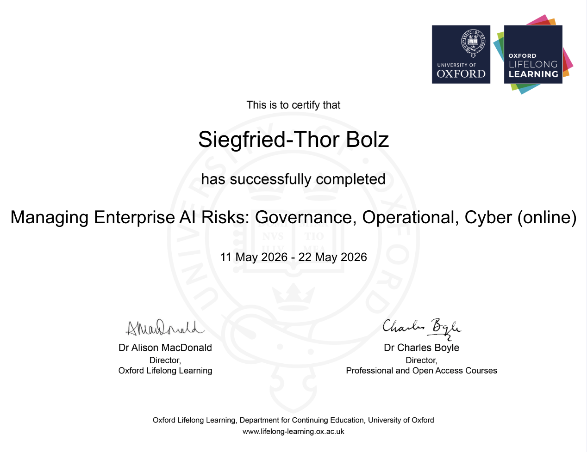
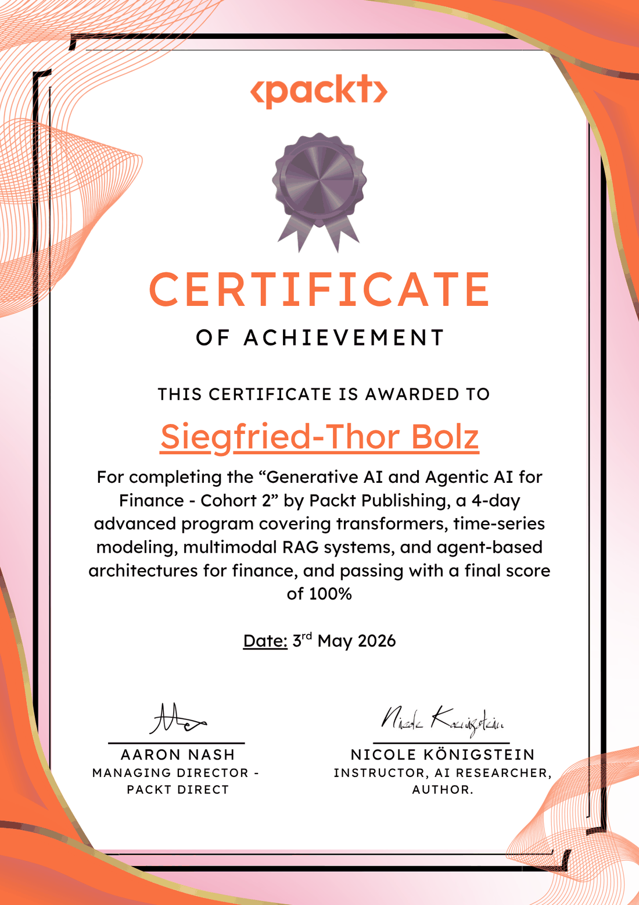

# AI Governance Watch

Last updated: 

A continuously-watched, **PR-gated reference library** of the AI governance
standards an external AI risk auditor has to keep current. Each standard has
its own page with a short, audit-oriented summary, a plain-language explainer,
the clauses you would cite, and a rolling log of what changed. Every page traces
back to a verifiable observation of a public source at a documented point in time.

> Built and maintained by **[Siegfried-Thor Bolz](https://www.siegfried-bolz.de)** —
> Enterprise **Adobe Experience Manager (AEM / AEMaaCS) architect & developer** and
> **AI risk auditor**, near Munich, Germany. *"Most compliance auditors don't read
> code. I do."*
> [Website](https://www.siegfried-bolz.de) ·
> [LinkedIn](https://www.linkedin.com/in/sbolz/) ·
> [GitHub](https://github.com/siegfriedbolz/ai-governance-watch)

!!! tip "How to use this library"
    New here? Start with **[Standards at a glance](at-a-glance.md)** to compare
    all eleven, or browse the **[glossary](glossary.md)**. Use the **search** (top
    of the page, or press `/`) to look across every standard at once. Open a
    standard to read its summary and audit anchors, and check the
    [changelog](changelog.md) to see what changed recently.

## Watched standards

### Frameworks & management systems

-   **[NIST AI RMF](reference_nist_ai_rmf.md)**

    ---

    The GOVERN / MAP / MEASURE / MANAGE framework, the GenAI Profile (600-1),
    and the Playbook. Voluntary, widely adopted, the common backbone.

-   **[ISO/IEC 42001](reference_iso_42001.md)**

    ---

    The first certifiable AI Management System (AIMS) standard, plus the
    surrounding 42000-series (incl. 42006 for certification bodies).

-   **[ISO/IEC 23894](reference_iso_23894.md)**

    ---

    Guidance on AI risk management — the "how" companion to ISO/IEC 42001 and
    ISO 31000.

### Regulation & law

-   **[EU AI Act](reference_eu_ai_act.md)**

    ---

    Regulation (EU) 2024/1689 — risk tiers, high-risk obligations, GPAI rules,
    and the Digital Omnibus (Reg. (EU) 2026/1744, in force since 27 July 2026)
    that moved the high-risk deadlines to 2027/28.

-   **[UK AI White Paper](reference_uk_ai_white_paper.md)**

    ---

    The UK's principles-based, sector-led "pro-innovation" approach (2023 White
    Paper + 2024 response), now evolving toward regulatory sandboxes.

-   **[DORA](reference_dora.md)**

    ---

    The EU Digital Operational Resilience Act — ICT and third-party resilience
    for finance; relevant to AI vendor and outage risk.

-   **[Switzerland — AI & data protection](reference_ch_ai_data_protection.md)**

    ---

    No Swiss AI act yet: the technology-neutral DSG applied to AI by the EDÖB,
    the Federal Council's sectoral decision (2025), and the ratification path
    for the Council of Europe AI Convention — consultation draft due end of 2026.

-   **[Council of Europe AI Convention (CETS 225)](reference_coe_ai_convention.md)**

    ---

    The first binding international AI treaty (2024): obligations on states,
    not companies; who has signed and ratified, why it is not yet in force, and
    how the EU, Switzerland and the UK implement it.

### Agentic, thresholds & landscape

-   **[CSA Agentic Profile](reference_csa_agentic_profile.md)**

    ---

    Cloud Security Alliance's agentic extension of the NIST AI RMF, plus the
    AI Controls Matrix and catastrophic-risk work.

-   **[Berkeley CLTC](reference_berkeley_cltc.md)**

    ---

    UC Berkeley's intolerable-risk and AI-enabled cyber-threat thresholds —
    the "red lines" layer of AI governance.

-   **[NIST ITL Standards Landscape](reference_nist_itl_landscape.md)**

    ---

    NIST ITL's map of the global AI standards landscape — the meta-source that
    flags new standards worth tracking.

## How this library stays current

A single scheduled watch routine checks each source on its cadence. When it
detects a substantive change, it opens a **pull request** with the proposed
update, the before/after snapshot hashes, and an auditor note. **Nothing lands
on a page without a human reviewing that diff** — the same provenance
discipline an external auditor must demonstrate to a client. See the
[changelog](changelog.md) for the running history.

About the author · professional services — the reference library above stands on its own

## About the author — work with me

This library is built and maintained by **Siegfried-Thor Bolz** — an Enterprise
**Adobe Experience Manager (AEM / AEMaaCS) architect & developer** and **AI risk
auditor** near Munich, Germany, and Managing Director of CQ-Factory GmbH (Adobe
Solution Partner, Silver). The red thread of my work: *from a rock-solid CMS to a
governed, secure, end-to-end AI integration.* I can both **build** AI platforms
and **audit** them against regulation — a rare combination. This watch system is
a live demonstration of that discipline: it's how I keep a regulatory map current
against a fast-moving target, with a defensible, provenance-backed trail.

??? note "How I can help — services, credentials & contact"

    - **AI governance, compliance & risk auditing** — assessing AI systems against
      the EU AI Act, NIST AI RMF, ISO/IEC 42001 & 27001, the OWASP LLM & Agentic
      Top 10 and MITRE ATLAS; risk classification, model cards, AI-SBOM, a living
      risk register and control testing along Three Lines of Defence.
    - **Active monitoring** — standing up watch pipelines like this one so your
      compliance map never silently drifts out of date.
    - **Secure, cloud-ready AEM & AI engineering** — AEM / AEMaaCS architecture,
      migrations and the *AEM Exit* to headless, plus RAG / agentic AI on Google
      Cloud — with web-application security and clean code at the core.

    See my applied guide: **[AI audit for enterprise CMS](ai-audit-for-cms.md)**.

    **Credentials** — University of Oxford, *"Managing Enterprise AI Risks"* (2026)
    · [Verify ↗](https://certificates.conted.ox.ac.uk/5d483a65-dba2-47a2-92b0-8acfe0dcfd3a)
    · Packt, *"Generative AI & Agentic AI for Finance"*, Cohort 2 — **100%** (2026)
    · Adobe Solution Partner — Silver (via CQ-Factory GmbH).

    { .sb-cert }
    { .sb-cert }

    **Let's talk:** [siegfried-bolz.de](https://www.siegfried-bolz.de) · [LinkedIn](https://www.linkedin.com/in/sbolz/) · [info@siegfried-bolz.de](mailto:info@siegfried-bolz.de) · [GitHub](https://github.com/siegfriedbolz/ai-governance-watch)

## Acknowledgement

This project is the operational realisation of **Phase 5 — Active Monitoring**
from **[Ajit Jaokar's](https://www.linkedin.com/in/ajitjaokar/)** concept of an *"Enterprise (collective) Second Brain using
Claude Skills"*: the idea that a plain-Markdown knowledge base becomes an
*executable* second brain when skills **reason over** what you know rather than
merely store it. Ajit (University of Oxford) was my tutor on the *Managing
Enterprise AI Risks* programme, and his framing is the intellectual backbone of
this watch system. Read the original:
[*The Enterprise (collective) Second Brain using Claude Skills*](https://www.linkedin.com/pulse/enterprise-collective-second-brain-using-claude-skills-ajit-jaokar-ykode/)
— Ajit Jaokar, LinkedIn (May 2026).

!!! note "Scope, licence & disclaimer"
    Each page has an **"In plain language"** explainer written in our own words —
    these are explanations, **not** the official or normative text, and **not
    legal advice**. We track **metadata, structure, and short quoted anchors**,
    never the full text. How much may be reproduced follows each source's
    licence, shown in every page's "Provenance & licence" box (e.g. NIST =
    public domain; EU/UK = reuse with attribution; CSA = CC BY-NC-SA; ISO =
    metadata only). Every page links back to its primary source.
